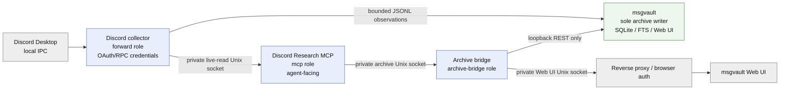

# Discord Research MCP

Discord Research MCP is a read-only research bridge for Discord. It combines an explicitly authorized Discord Desktop local-RPC/OAuth2 acquisition path with a small Discord-focused MCP surface for current channel snapshots and local archive research.

The product is designed for evidence gathering, not account automation. It does not use normal-user session tokens, self-bot techniques, Discord Client Experiment APIs, message writes, read-state mutations, or attachment-binary acquisition.

## Architecture

The image supports three runtime roles. The reference deployment uses those roles across three Discord Research processes/containers plus the existing msgvault writer because they cross different credential and network boundaries.



1. **forward** owns the Discord Desktop IPC/OAuth2 session, selected-source subscriptions, observation normalization, token rotation state, coverage health, and the private live-read control socket.
2. **archive-bridge** joins msgvault's isolated network namespace, connects only to the existing loopback msgvault REST API, republishes a curated archive-query subset over a private Unix socket, and can export the first-party msgvault Web UI/API over a second private Unix socket.
3. **mcp** exposes the agent-facing Discord tools. It has no Discord credentials and talks only to the two Unix sockets.
4. **msgvault** remains a separate upstream/downstream product and the sole durable archive writer.

The container split is a deployment choice, not a product requirement. A deployment may combine the `forward` and `mcp` roles when it intentionally accepts that the agent-facing process then shares the collector's Discord credential/mount boundary. The reference deployment keeps them separate. Combining `archive-bridge` with the other Discord roles is not equivalent while msgvault remains `network_mode: none`, because the bridge must share msgvault's isolated network namespace.

## Agent tools

The MCP surface is intentionally small:

- search_messages
- get_message
- list_messages
- search_thread
- read_channel

See docs/tools.md for inputs, limits, provenance, and failure behavior.

## Coverage and provenance

Every result is explicit about what it proves.

- read_channel returns acquisition=live_rpc, complete_history=false, and exactly one bounded Discord GET_CHANNEL snapshot.
- Direct archived observations return acquisition=local_rpc_observation, complete_history=false.
- Public mirror evidence returns acquisition=public_git_mirror, complete_history=false, plus stored repository/commit provenance and an optional deployment-supplied mirror cutoff.

An archive miss is terminal. It never falls back to Discord.

## Published container and Docker Compose

The maintained container image is published on GitHub Container Registry:

```text
ghcr.io/x1pher/discord-research-mcp:v0.5.2
```

A representative `compose.yaml` is included for the complete five-tool deployment using four runtime containers: collector, Discord MCP façade, archive bridge, and the existing msgvault writer. It preserves the provider/archive separation and uses an existing msgvault writer as the archive backend.

```sh
cp .env.example .env
# Edit .env and examples/selected-sources.json.
docker compose --env-file .env config -q
docker compose pull
docker compose up -d
```

See [docs/docker-compose.md](docs/docker-compose.md) for prerequisites, tested compatibility, archive/import ownership, and security boundaries.

## Tested compatibility

| Component | Baseline |
| --- | --- |
| Container platform | Docker Engine + Docker Compose v2 on Linux |
| Published image | `linux/amd64` |
| Source/runtime | Node.js 22 |
| Discord | Desktop local RPC/IPC with OAuth2 scopes `rpc,identify,guilds,messages.read` |
| Archive | msgvault `0.19.3-x1pher.7` REST API against an existing writer/data directory |

Other combinations may work but are not claimed as tested by this release.

## Requirements

- A Discord Desktop client whose local IPC socket is available to the collector.
- A Discord OAuth2 application authorized for the scopes required by your deployment. The intended research baseline is rpc,identify,guilds,messages.read.
- A selected-source configuration file.
- For archive tools: a msgvault release whose read-only MCP get_message response exposes the sanitized source_provenance field for imported mirror evidence.
- Node.js 22 for source development, or the published container image for deployment.

## Configuration

### Collector: forward

Required deployment values are supplied at runtime; none are shipped as product defaults.

| Variable | Purpose |
| --- | --- |
| DISCORD_CLIENT_ID | OAuth2 application/client ID. |
| DISCORD_SCOPES | Comma-separated OAuth2 scopes. |
| DISCORD_REDIRECT_URI | Registered OAuth2 redirect URI. |
| DISCORD_CLIENT_SECRET_FILE | Read-only file containing the client secret. |
| DISCORD_REFRESH_TOKEN_FILE | Read-only bootstrap refresh-token file. |
| DISCORD_TOKEN_STATE_FILE | Private application-owned latest refresh-token state. |
| DISCORD_SELECTION_FILE | Versioned selected-source JSON file. |
| DISCORD_HEALTH_FILE | Content-free acquisition health record. |
| DISCORD_IMPORT_HEALTH_FILE | Content-free importer health record. |
| DISCORD_OBSERVATION_DIR | Private JSONL handoff directory. |
| DISCORD_CONTROL_SOCKET | Private Unix socket used by read_channel. |

Forum-thread state is optional and configured with DISCORD_FORUM_THREAD_STATE_FILE when the deployment uses persisted explicit thread seeds.

### Archive bridge: archive-bridge

| Variable | Purpose |
| --- | --- |
| DISCORD_ARCHIVE_SOCKET | Private Unix socket created for the MCP façade. |
| DISCORD_ARCHIVE_RUNTIME_FILE | Absolute path to msgvault `daemon.1.json`; only a `127.0.0.1` runtime address is accepted. |
| DISCORD_ARCHIVE_WEB_SOCKET | Optional private Unix socket that exports the existing msgvault Web UI/API from the isolated namespace. |
| DISCORD_SELECTION_FILE | Used to derive the allowed local archive source identifiers. |
| DISCORD_MIRROR_CUTOFF | Optional evidence cutoff attached only to public-mirror results. |

The intended deployment keeps the msgvault writer network-isolated. `archive-bridge` joins that same namespace, talks to the existing loopback REST API, and exports only private Unix sockets.

### Agent MCP: mcp

| Variable | Purpose |
| --- | --- |
| DISCORD_CONTROL_SOCKET | Live-read collector socket. |
| DISCORD_ARCHIVE_SOCKET | Archive bridge socket. |
| DISCORD_MCP_HOST | HTTP listen host. |
| DISCORD_MCP_PORT | HTTP listen port. |
| DISCORD_MCP_ALLOWED_HOSTS | Optional comma-separated Host-header allowlist. |

## Source selection

Selection is configuration, never a product default. Example:

~~~json
{
  "version": 1,
  "sources": [
    {"guild_id": "700", "channel_id": "800"},
    {"guild_id": "700", "channel_id": "801"}
  ]
}
~~~

The IDs above are synthetic. A selected forum parent may admit only provider-validated child thread channels whose guild, type, and parent_id bind them to that selected parent.

## Observation handoff

The collector publishes private version-1 JSONL observations. A deployment may import them through msgvault's import-discord-observations command, but the deployment must preserve msgvault's single-writer contract. Docker invocation, host paths, acknowledgement cleanup, backup wiring, and scheduling are deliberately outside this product.

## Development

~~~sh
npm ci --ignore-scripts
npm test
python3 scripts/public-scrub.py
docker build -t discord-research-mcp:dev .
~~~

## Security

Read SECURITY.md and docs/security-provider-boundary.md before deploying. The archive adapter is intentionally loopback-only and the agent-facing surface contains no write/delete/stage/export tools.

## License

MIT. See LICENSE.
