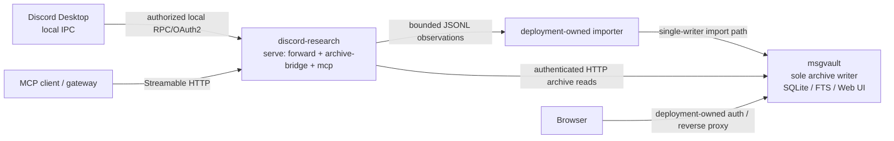

# Discord Research MCP

[](https://github.com/X1pheR/discord-research-mcp/actions/workflows/ci.yml)
[](https://github.com/X1pheR/discord-research-mcp/actions/workflows/codeql.yml)
[](https://github.com/X1pheR/discord-research-mcp/releases)
[](LICENSE)

Discord Research MCP is an independent, community-maintained, **read-only MCP server for Discord research**. It combines an explicitly authorized Discord Desktop local-RPC/OAuth2 acquisition path with a small Discord-focused MCP surface for bounded current-channel reads and provenance-aware research over a local [msgvault](https://github.com/X1pheR/msgvault) archive.

This project is not affiliated with, endorsed by, or officially maintained by Discord. Discord remains the authorization boundary for live provider access; msgvault remains a separate product and the sole durable archive writer.

The product is designed for evidence gathering, not account automation. It does **not** use normal-user session tokens, self-bot techniques, Discord Client Experiment APIs, message writes, read-state mutations, automatic provider fallback, account-wide history crawling, or attachment-binary acquisition.

## Why this repository exists

The reusable Discord acquisition and research behavior belongs in a product repository rather than in deployment-specific infrastructure. This repository therefore owns:

- the Discord Desktop OAuth2/local-RPC client behavior;
- selective forward acquisition and normalized observation output;
- bounded explicit live channel reads;
- the curated five-tool Discord MCP surface;
- the adapter that maps those archive tools onto an authenticated msgvault HTTP API;
- provenance and incomplete-history semantics;
- tests, container builds, CI/security checks and versioned releases.

It deliberately does **not** own a msgvault writer, archive database, reverse proxy, browser authentication, deployment-specific source IDs, host paths, secret delivery, backup scheduling, or MCP gateway policy.

## Current compatibility baseline

| Component | Tested baseline |
| --- | --- |
| Discord Research MCP release | `v0.5.6` |
| Container platform | Docker Engine + Docker Compose v2 on Linux |
| Published image | `linux/amd64` |
| Runtime | Node.js 22 |
| Discord | Desktop local RPC/IPC with OAuth2 scopes `rpc,identify,guilds,messages.read` |
| Archive backend | msgvault `0.19.3-x1pher.7` authenticated HTTP API |
| MCP transport | Streamable HTTP on `/mcp`; health on `/healthz` |

Other combinations may work, but they are not claimed as tested by this release.

## Architecture

The reference deployment has **two product containers**:

1. `discord-research`, running the product's `forward`, `archive-bridge`, and `mcp` child processes under the supervised `serve` command;
2. an existing `msgvault` writer, reachable only through an authenticated internal HTTP endpoint in the deployment.



The three Discord roles are process boundaries, not container boundaries:

- **forward** owns the Discord Desktop IPC/OAuth2 session, selected-source subscriptions, normalized observations, token rotation state, acquisition health, and the live-read control socket.
- **archive-bridge** owns only the curated Discord-to-msgvault query mapping. In the reference deployment it authenticates to msgvault with an API key supplied as a secret file.
- **mcp** exposes the five agent-facing Discord tools and communicates with the two sibling processes through private in-container Unix sockets.

All three roles intentionally share one container trust boundary in the reference deployment. msgvault stays separate because it owns durable archive state and the single-writer lifecycle.

## MCP tools

All tools are read-only.

| Tool | Purpose | Provider behavior |
| --- | --- | --- |
| `search_messages` | Full-text search of configured archived Discord evidence. | Archive-only; a miss never contacts Discord. |
| `get_message` | Read bounded body context for one archive result. | Archive-only. |
| `list_messages` | List a bounded page in one archived conversation/thread. | Archive-only. |
| `search_thread` | Search a bounded local page within one archived conversation/thread. | Archive-only. |
| `read_channel` | Read one explicit account-visible channel as a current snapshot. | Exactly one bounded Discord `GET_CHANNEL`; never persisted automatically. |

See [`docs/tools.md`](docs/tools.md) for the complete input, limit, provenance and failure contract.

## Provenance and coverage

Every result states what it actually proves:

- `read_channel`: `acquisition=live_rpc`, `complete_history=false`, one bounded current-client snapshot;
- direct archived observations: `acquisition=local_rpc_observation`, `complete_history=false`;
- imported public-mirror evidence: `acquisition=public_git_mirror`, `complete_history=false`, with stored repository/commit provenance and an optional deployment-supplied cutoff.

Archive presence never upgrades evidence to “complete history”. An archive miss is terminal and never falls back to Discord.

## Container image

Versioned images are published to GitHub Container Registry:

```text
ghcr.io/x1pher/discord-research-mcp:v0.5.6
```

The Git tag, package version, MCP server version and image tag use the same release version.

## Quick start

The included [`compose.yaml`](compose.yaml) runs **one `discord-research` service**. It expects an existing msgvault writer on a shared Docker network. msgvault is a separate product and keeps its own deployment/release lifecycle.

Prerequisites:

- Discord Desktop is running and its IPC directory is mountable by Docker.
- A Discord OAuth2 application is authorized for `rpc,identify,guilds,messages.read`.
- A msgvault writer is already running on a Docker network reachable by `discord-research`.
- The msgvault HTTP API requires an API key; store the same key in a read-only file for Discord Research.
- Your archive import/acknowledgement path is configured separately; this product does not create a second msgvault writer.

Copy and edit the example environment:

```sh
cp .env.example .env
mkdir -p runtime/secrets
# Write your Discord client secret, bootstrap refresh token and msgvault API key
# into the files referenced by .env. Never commit those files.

# Edit examples/selected-sources.json with your authorized guild/channel parents.
docker compose --env-file .env config -q
docker compose pull
docker compose up -d
```

Check health:

```sh
curl --fail http://127.0.0.1:3021/healthz
```

The MCP endpoint is `http://127.0.0.1:3021/mcp` with the default example binding.

See [`docs/docker-compose.md`](docs/docker-compose.md) for the msgvault network/API contract, secret-file setup, archive import ownership and deployment security notes.

## Configuration

### Discord provider and acquisition

| Variable | Purpose |
| --- | --- |
| `DISCORD_CLIENT_ID` | Discord OAuth2 application/client ID. |
| `DISCORD_SCOPES` | OAuth2 scopes; tested baseline is `rpc,identify,guilds,messages.read`. |
| `DISCORD_REDIRECT_URI` | Registered OAuth2 redirect URI. |
| `DISCORD_CLIENT_SECRET_FILE` | Read-only file containing the Discord client secret. |
| `DISCORD_REFRESH_TOKEN_FILE` | Read-only bootstrap refresh-token file. |
| `DISCORD_TOKEN_STATE_FILE` | Private application-owned latest refresh-token state. |
| `DISCORD_FORUM_THREAD_STATE_FILE` | Optional persisted explicit forum-thread seed state. |
| `DISCORD_SELECTION_FILE` | Selected-source JSON configuration. |
| `DISCORD_HEALTH_FILE` | Content-free acquisition health record. |
| `DISCORD_IMPORT_HEALTH_FILE` | Content-free importer health record. |
| `DISCORD_OBSERVATION_DIR` | Private normalized JSONL handoff directory. |

### Archive adapter

| Variable | Purpose |
| --- | --- |
| `DISCORD_ARCHIVE_BASE_URL` | Authenticated msgvault HTTP base URL, for example `http://msgvault:8080/`. |
| `DISCORD_ARCHIVE_API_KEY_FILE` | Read-only file containing the msgvault API key. |
| `DISCORD_ARCHIVE_SOCKET` | Private in-container Unix socket between `archive-bridge` and `mcp`. |
| `DISCORD_MIRROR_CUTOFF` | Optional evidence cutoff applied only to public-mirror provenance. |

### MCP listener

| Variable | Purpose |
| --- | --- |
| `DISCORD_CONTROL_SOCKET` | Private in-container live-read socket between `forward` and `mcp`. |
| `DISCORD_ARCHIVE_SOCKET` | Private in-container archive socket. |
| `DISCORD_MCP_HOST` | MCP HTTP listen host. |
| `DISCORD_MCP_PORT` | MCP HTTP listen port. |
| `DISCORD_MCP_ALLOWED_HOSTS` | Optional comma-separated Host-header allowlist. |

## Source selection

Selection is configuration, never a product default. The checked-in example uses synthetic IDs:

```json
{
  "version": 1,
  "sources": [
    {"guild_id": "700", "channel_id": "800"},
    {"guild_id": "700", "channel_id": "801"}
  ]
}
```

A selected forum parent may admit only provider-validated child thread channels whose guild, type and `parent_id` bind them to that selected parent.

## Observation handoff

`forward` writes private version-1 JSONL observations. A deployment may import them through msgvault's `import-discord-observations` path, but it must preserve msgvault's single-writer contract.

Docker invocation, importer scheduling, acknowledgement cleanup, host storage paths, backup wiring and recovery policy remain deployment-owned rather than product-owned.

## Security model

The main guarantees are:

- no normal-user Discord token or self-bot path;
- no Discord writes or read-state mutations;
- no automatic archive-to-provider fallback;
- no attachment-binary acquisition;
- source scope is configuration-driven and revalidated;
- msgvault credentials are supplied through external secret files;
- the current reference topology uses authenticated msgvault HTTP on a deployment-owned internal network;
- the public example publishes no msgvault host port because msgvault is not defined by this repository;
- the agent-facing MCP namespace contains only the five reviewed Discord tools.

Read [`SECURITY.md`](SECURITY.md) and [`docs/security-provider-boundary.md`](docs/security-provider-boundary.md) before deployment.

## Development and verification

Node.js 22 is the tested development runtime.

The canonical repository-local verification gate is:

```sh
./scripts/verify.sh
```

It installs the locked dependencies, runs the product tests, checks public-source hygiene and public package consistency, validates the Compose example when Docker Compose is available, and builds the container image when Docker is available. CI and release workflows reuse this gate.

## Feedback and contributions

Use [GitHub Issues](https://github.com/X1pheR/discord-research-mcp/issues) for focused bugs and proposals. Pull requests should remain within the documented read-only/provider/archive boundaries and include applicable tests and documentation updates.

Roadmap and project planning live in [GitHub Projects](https://github.com/X1pheR/discord-research-mcp/projects).

See [`CONTRIBUTING.md`](CONTRIBUTING.md) for the development workflow. Security reports must follow [`SECURITY.md`](SECURITY.md).

User-visible changes are summarized in [`CHANGELOG.md`](CHANGELOG.md).

## Release model

A release is accepted only when the package version, MCP server version, Git tag and GHCR tag agree and the repository verification gate passes.

```text
package:   0.5.6
Git tag:   v0.5.6
image:     ghcr.io/x1pher/discord-research-mcp:v0.5.6
```

Deployment-specific msgvault versions, source selections, credentials, reverse proxies and backup policies are independent concerns and are not embedded in the image.

## License and project relationships

Discord Research MCP is licensed under the [MIT License](LICENSE).

Discord is an independent upstream service governed by Discord's own software, authorization and policies. msgvault is a separate open-source archive product with its own source, releases and licensing. This repository does not redistribute Discord Desktop or msgvault.
